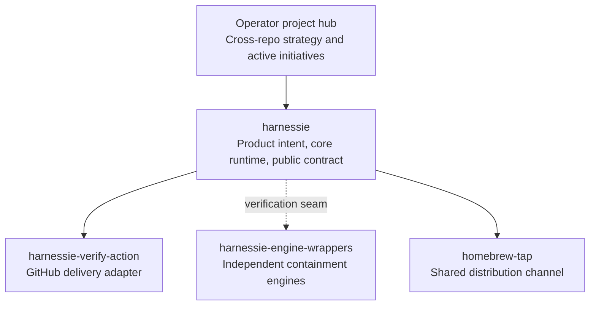

# Harnessie ecosystem

Harnessie is managed as a federated project. The repositories keep separate histories, security claims, and release cadences; this repository is the public product authority and clone-portable technical control plane.



`homebrew-tap` is shared Snap Synapse distribution infrastructure, not a Harnessie component. The product therefore has three implementation repositories and one packaging channel.

## Authority map

| State | Authoritative home |
|---|---|
| Product identity, invariants, and roadmap | `harnessie/INTENT.md` and `harnessie/ROADMAP.md` |
| Core implementation and public documentation | `snapsynapse/harnessie` |
| Cross-repo strategy and active initiatives | Operator-side project hub |
| Wrapper guarantees and platform boundaries | `harnessie-engine-wrappers/PROJECT_CONTEXT.md` and its probes |
| Action-specific security and release behavior | `harnessie-verify-action/PROJECT_CONTEXT.md`, `action.yml`, and its tests |
| Formula implementation | `homebrew-tap/Formula/harnessie.rb` |
| Implementation issues | The repository that owns the affected code |
| Cross-repo decisions | Operator-side project hub, with the adopted public contract reflected in every affected repository |
| Release propagation | `harnessie/RELEASE_CHECKLIST.md` |

## Release trains

The core release train is ordered:

1. Release `harnessie` to PyPI and GitHub.
2. Test and update the default Harnessie pin in `harnessie-verify-action`.
3. Update and test `Formula/harnessie.rb` in `homebrew-tap`.
4. Record the resulting component versions in the Harnessie release notes and handoff.

Engine wrappers release independently. They join the core train only when Harnessie consumes a versioned verification seam. A new wrapper claim is not supported until its live executable probe passes on the claimed platform.

## Working rules

- Do not use git submodules or merge the repositories into a monorepo. Their lifecycles and security claims are intentionally different.
- Put implementation issues and pull requests in the repository that owns the affected code.
- Track one cross-repo initiative in the operator project hub, linking to the owning repositories' issues and pull requests.
- Keep cross-repo strategy in the operator project hub and durable public operating contracts in git. Do not duplicate unstable working notes into repository files.
- Treat GitHub as a collaboration and release surface, not the sole source of recovery or project visibility.
- Keep `NEXT.md` executable and current. Link here instead of restating satellite internals.
- Keep satellite `PROJECT_CONTEXT.md` files local to their own guarantees and link back to this contract.

## Local status command

`ecosystem.yaml` is the machine-readable topology. From a checkout under a directory containing the sibling repositories, run:

```bash
python3 scripts/ecosystem_status.py
```

The command is read-only and offline by default. It reports local branch, revision, dirty state, component versions, the action's Harnessie pin, the Homebrew formula version, and version drift. Use `--json` for machine-readable output, `--validate` to validate only the manifest, or `--git-root <path>` when the sibling checkouts live elsewhere. `--github` optionally adds latest-release and open-pull-request observations through the authenticated GitHub CLI; those observations are a mirror, never required for local status.

The command does not mutate repositories, query credentials, publish state, or introduce a dashboard. Missing local checkouts are reported as unavailable rather than silently inferred from a cloud service.
